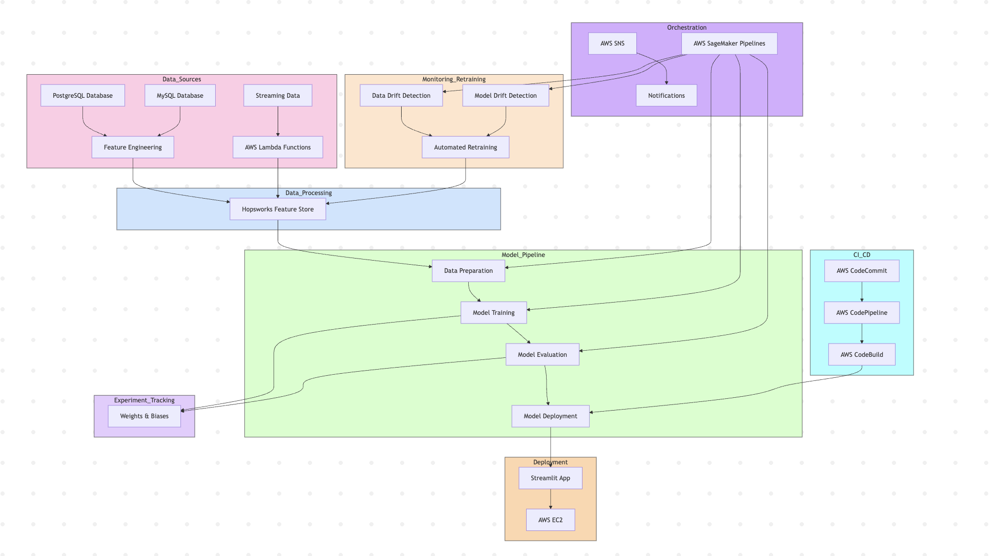

# PredictiveLogisticsMLOps
Developed an end-to-end ML pipeline to predict truck delivery delays using real-world logistics data. Built modular data pipelines with PostgreSQL &amp; MySQL, deployed a Streamlit app, and automated retraining with AWS SageMaker Pipelines and Evidently AI. Leveraged Hopsworks as a feature store and Weights &amp; Biases for model tracking.

## 🗂️ Project Architecture




A real-world, production-grade machine learning system to **predict truck delivery delays** using historical and simulated real-time logistics data. This project combines powerful **ML modeling**, **cloud-native data pipelines**, **feature store architecture**, and **CI/CD automation** to create a fully operational MLOps solution.

---

## 📖 Table of Contents
- [Use Case](#use-case)
- [Features](#features)
- [Architecture](#architecture)
- [Tech Stack](#tech-stack)
- [Pipeline Phases](#pipeline-phases)
- [Screenshots](#screenshots)
- [How to Run](#how-to-run)
- [Results](#results)
- [Tags](#tags)

---

## 🌐 Use Case
Delays in truck deliveries result in financial penalties, operational chaos, and poor customer experience. Our solution helps logistics teams:
- Predict late deliveries in advance
- Get notified via alerts
- Retrain models when drift is detected
- Make better, real-time route and driver decisions

---

## ✨ Features
- Predicts delivery delays using traffic, weather, and truck/driver details
- Uses **Hopsworks Feature Store** for managed features
- Real-time predictions via **Streamlit** web app
- Drift detection with **Evidently AI**
- Automated retraining using **AWS SageMaker Pipelines**
- Monitored and triggered via **AWS Step Functions & Lambda**
- Full experiment tracking in **Weights & Biases (W&B)**
- CI/CD automation using **Docker**, **CDK**, and **AWS CodePipeline**

---


## 🛠️ Tech Stack
- **Languages**: Python, SQL
- **Modeling**: scikit-learn, XGBoost, RandomForest
- **Experiment Tracking**: Weights & Biases (wandb)
- **Feature Store**: Hopsworks
- **Infrastructure**: AWS (SageMaker, Lambda, SNS, Step Functions, EC2)
- **UI**: Streamlit
- **Monitoring**: Evidently AI
- **CI/CD**: AWS CDK, CodePipeline, Docker

---

## 📆 Pipeline Phases
### Phase 1: Data Engineering
- Load data from MySQL/PostgreSQL into AWS RDS
- Join 7+ datasets (traffic, schedule, driver, weather)
- Feature engineering using timestamps, lag features, merging
- Push final features to Hopsworks

### Phase 2: Modeling + Streamlit
- Train Logistic Regression, Random Forest, and XGBoost
- Handle class imbalance and track metrics in W&B
- Deploy best model to EC2 and serve with Streamlit

### Phase 3: Monitoring + Retraining
- Use Evidently AI to detect data/model drift
- Automatically trigger retraining pipelines using Step Functions
- Retraining managed with SageMaker jobs
- Alerts sent to managers via AWS SNS


---

## 💡 How to Run
1. Clone the repo
2. Create and activate virtualenv
3. Add your `config.yaml` and `.env`
4. Run: `python engine.py` to trigger pipeline manually
5. Use `streamlit run app.py` for UI
6. Monitor logs: `logs/truck_eta_info_logs.log`

---

## 🔺 Results
- Achieved 92%+ F1 Score on test data
- Handled 100,000+ predictions with streaming simulation
- Detected and responded to drift with weekly checks
- Delivered end-to-end automation across all phases

---

## 🌟 Tags
```
#MachineLearning #MLOps #EndToEndML #PredictiveAnalytics #AWS #SageMaker
#CI_CD #ModelMonitoring #DataDrift #ModelDrift #Streamlit #FeatureStore
#SmartLogistics #ETAPrediction #SupplyChainAI #Python #Docker #WeightsAndBiases
#RealTimeData #InfrastructureAsCode
```

---


